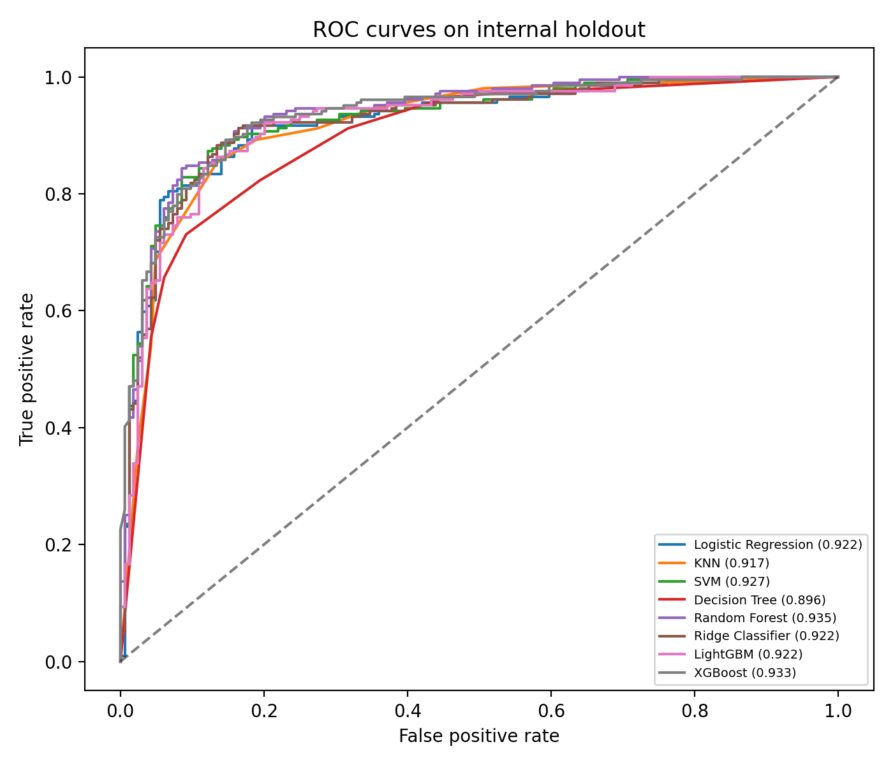
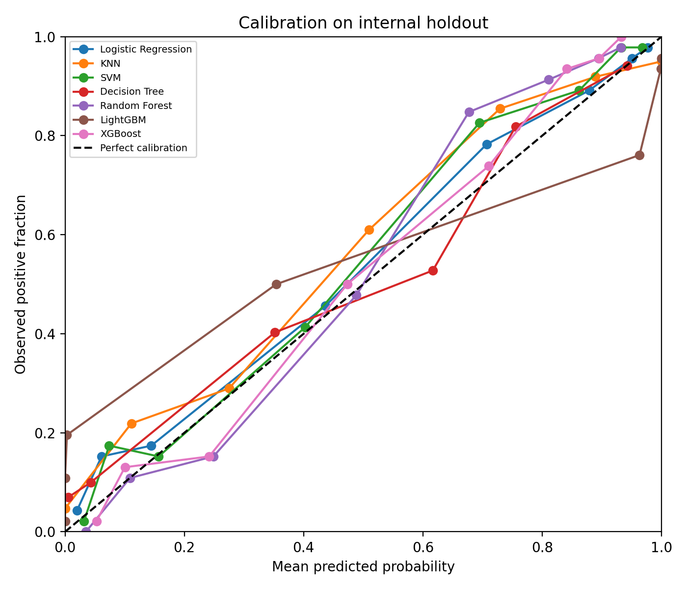
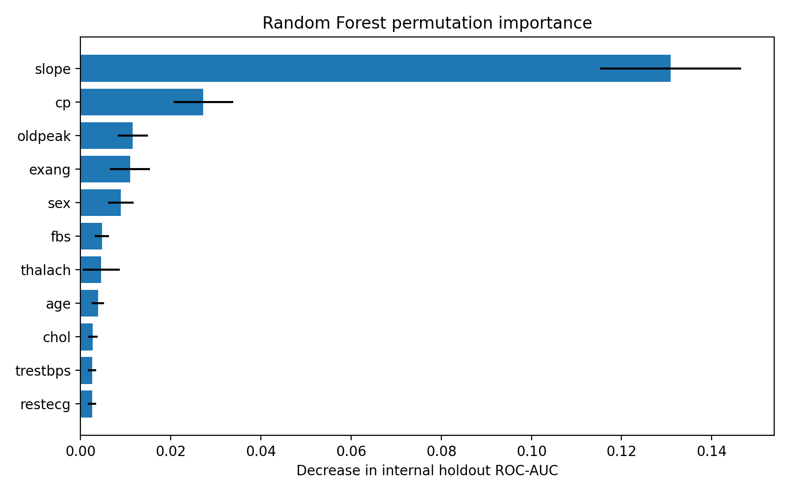

# Heart Disease Classification with Source Overlap Auditing and Leakage-Controlled Validation

This repository contains the Python code and analysis outputs accompanying the manuscript:

> **Heart Disease Classification with Source Overlap Auditing and Leakage-Controlled Validation**

The study examines how record overlap, inconsistent categorical codes, and conflicting outcome directions affect machine learning evaluation in publicly distributed heart disease data. Eight established classifiers are compared after a record-level source audit and leakage-controlled preprocessing. The study evaluates existing heart disease status. It does not estimate prospective heart attack or cardiovascular risk.

## Study overview

Three publicly distributed files initially contained 2,518 rows:

| Distributed file | Rows | Distinct records after within-file deduplication | Within-file excess copies |
|---|---:|---:|---:|
| Dataset shared on Kaggle [1] | 303 | 302 | 1 |
| Dataset shared on Kaggle [2] | 1,025 | 302 | 723 |
| Dataset shared on IEEE DataPort [3] | 1,190 | 918 | 272 |
| **Total** | **2,518** |  | **996** |

The audit first aligned the categorical codes and outcome direction across files. The two Kaggle-shared files represented the same 302 distinct records. All 302 records also matched records in the IEEE DataPort-shared file after harmonization. Following within-file deduplication, the two Kaggle-shared files contributed 604 additional cross-file copies. Retaining one instance of every harmonized record produced the final analysis dataset of **918 distinct records**, comprising **410 target-negative** and **508 target-positive** observations.

The distributed files do not constitute three independent clinical cohorts. All retained records were present in the IEEE DataPort-shared file. Consequently, source-wise external validation was not available.

## Main analytical design

The 918 records were partitioned with outcome stratification and random seed 42:

- Development partition: 550 records
- Reserved internal holdout: 368 records
- Holdout fraction: 40%

The analysis includes:

- record-level integrity checks before partitioning;
- training-partition-specific numerical and categorical imputation;
- one-hot encoding of nominal predictors;
- numerical standardization fitted within each training partition;
- training-only synthetic augmentation in the primary eight-model comparison;
- inner-fold hyperparameter selection;
- ten-fold outer and five-fold inner nested cross-validation;
- three repetitions of five-fold stratified cross-validation with three-fold inner selection;
- one evaluation on the reserved internal holdout;
- outcome-stratified bootstrap intervals using 1,500 resamples of fixed holdout predictions;
- exploratory Friedman and paired Wilcoxon comparisons;
- calibration analysis;
- Random Forest impurity and permutation importance;
- Random Forest augmentation sensitivity, component, and encoding analyses.

The reserved holdout is an **internal holdout**, not an external clinical validation cohort.

## Evaluated classifiers

1. Logistic Regression
2. K-Nearest Neighbors
3. Support Vector Machine
4. Decision Tree
5. Random Forest
6. Ridge Classifier
7. LightGBM
8. XGBoost

## Data sources

The record audit was based on files obtained from the following public dataset pages:

1. [Heart Attack Dataset, Kaggle](https://www.kaggle.com/datasets/pritsheta/heart-attack)
2. [Heart Disease Dataset, Kaggle](https://www.kaggle.com/datasets/johnsmith88/heart-disease-dataset)
3. [Heart Disease Dataset (Comprehensive), IEEE DataPort](https://doi.org/10.21227/dz4t-cm36)

Users must review and comply with the terms and licenses specified by the original data providers. Access to IEEE DataPort may require authentication.

## Analysis variables

The final analysis uses 11 common predictors and one binary outcome.

| Variable | Description | Representation in the analysis |
|---|---|---|
| `age` | Age | Numerical, years |
| `sex` | Sex code | Binary indicator |
| `cp` | Chest pain type | Nominal category after source-code alignment |
| `trestbps` | Resting blood pressure | Numerical, mmHg |
| `chol` | Serum cholesterol | Numerical, mg/dL |
| `fbs` | Fasting blood sugar indicator | Binary indicator |
| `restecg` | Resting ECG result | Nominal category after source-code alignment |
| `thalach` | Maximum heart rate achieved | Numerical, beats/min |
| `exang` | Exercise-induced angina | Binary indicator |
| `oldpeak` | Exercise-induced ST depression relative to rest | Numerical |
| `slope` | ST-segment slope | Nominal category after source-code alignment |
| `target` | Existing heart disease status | 0 = absent, 1 = present |

The `ca` and `thal` variables are excluded because they are not available in all three distributed files.

In the final dataset, 172 cholesterol values and one resting blood pressure value recorded as zero are represented as missing in memory. They are imputed within the relevant training partition. One `slope=0` observation is retained as a separate nominal source category because its meaning could not be verified from the available metadata.

## Repository structure

```text
HeartDiseaseRiskPredictionML/
├── Codes/
│   ├── step1.py
│   ├── step2.py
│   └── step3.py
├── Dataset/
│   ├── Heart Attack Data Set.csv
│   ├── heart.csv
│   ├── heart_statlog_cleveland_hungary_final.csv
│   └── dataset.csv
├── Results/
│   ├── analysis_manifest.json
│   ├── data_integrity.xlsx
│   ├── split_membership.xlsx
│   ├── final_holdout_test_results.xlsx
│   ├── holdout_bootstrap_95CI.xlsx
│   ├── nested_cv_results_with_95CI.xlsx
│   ├── repeated_summary_with_95CI.xlsx
│   ├── friedman_test_results.xlsx
│   ├── pairwise_wilcoxon_tests.xlsx
│   ├── augmentation_sensitivity.xlsx
│   ├── component_ablation.xlsx
│   ├── encoding_comparison.xlsx
│   ├── feature_importance_comparison.xlsx
│   ├── calibration_curves.png
│   ├── holdout_roc_curves.png
│   ├── rf_permutation_importance.png
│   └── ...
└── README.md
```

The three source CSV files are retained for provenance. `Dataset/dataset.csv` is a legacy compiled file and is not read by the current three-step workflow. The current scripts analyze a separate, headerless Excel workbook containing the 918 audited records. Set its location through the `HEART_DATA_FILE` environment variable.

## Installation

Python 3.10 or a later compatible version is recommended.

```bash
python -m venv .venv
source .venv/bin/activate
python -m pip install --upgrade pip
python -m pip install pandas numpy scipy scikit-learn lightgbm xgboost matplotlib openpyxl
```

On Windows PowerShell, activate the environment with:

```powershell
.venv\Scripts\Activate.ps1
```

## Input workbook requirements

The input workbook must:

- contain exactly 918 data rows and 12 columns;
- contain no header row;
- begin with data in the first row;
- use the following column order:

```text
age, sex, cp, trestbps, chol, fbs, restecg, thalach, exang, oldpeak, slope, target
```

- contain 410 target-negative and 508 target-positive records;
- contain no exact duplicate rows;
- contain no repeated predictor vectors.

`step1.py` validates these conditions and stops if the workbook does not match them.

## Running the analysis

Run the scripts in numerical order. Set a separate output directory if you want to preserve the precomputed files in `Results/`.

### Windows PowerShell

```powershell
$env:HEART_DATA_FILE = "D:\path\to\heart_unique_records_no_header.xlsx"
$env:HEART_RESULTS_DIR = "$PWD\reproduction_results"

python Codes\step1.py
python Codes\step2.py
python Codes\step3.py
```

### Linux or macOS

```bash
export HEART_DATA_FILE="/absolute/path/to/heart_unique_records_no_header.xlsx"
export HEART_RESULTS_DIR="$(pwd)/reproduction_results"

python Codes/step1.py
python Codes/step2.py
python Codes/step3.py
```

The scripts perform the following tasks:

- `step1.py` validates the dataset, freezes the development and holdout membership, generates integrity and exploratory summaries, and records the input SHA-256 fingerprint.
- `step2.py` runs nested cross-validation, repeated cross-validation, and final internal holdout evaluation for all eight classifiers.
- `step3.py` performs the exploratory statistical comparisons, holdout bootstrap analysis, calibration analysis, Random Forest importance analysis, and focused sensitivity and component analyses.

Steps 2 and 3 save progress files during long-running computations. Restarting a script with the same dataset, code, and settings resumes compatible completed work. Random Forest, LightGBM, and XGBoost searches can require substantial processing time.

## Leakage-control strategy

The development and holdout membership is created before model fitting. The internal holdout is not used to estimate preprocessing parameters, generate synthetic observations, select hyperparameters, choose the augmentation setting, or compare categorical encodings.

Within each development or cross-validation training partition, the workflow applies:

1. numerical median and categorical mode imputation;
2. optional training-only augmentation;
3. one-hot encoding of `cp`, `restecg`, and `slope`;
4. standardization of numerical predictors;
5. model fitting and inner-fold hyperparameter selection.

Sex, fasting blood sugar, and exercise-induced angina remain binary indicators. Validation folds and the internal holdout are transformed using parameters fitted only on their corresponding training data. They are never augmented.

## Main results

### Internal holdout

| Model | Accuracy | Precision | Recall | F1 | ROC-AUC | Brier score |
|---|---:|---:|---:|---:|---:|---:|
| Logistic Regression | 0.8614 | 0.8844 | 0.8627 | 0.8734 | 0.9224 | 0.1058 |
| KNN | 0.8587 | 0.8878 | 0.8529 | 0.8700 | 0.9167 | 0.1133 |
| SVM | 0.8641 | 0.8969 | 0.8529 | 0.8744 | 0.9265 | 0.1042 |
| Decision Tree | 0.8152 | 0.8400 | 0.8235 | 0.8317 | 0.8958 | 0.1260 |
| Random Forest | 0.8723 | 0.8867 | 0.8824 | 0.8845 | **0.9354** | **0.1013** |
| Ridge Classifier | 0.8668 | **0.8974** | 0.8578 | 0.8772 | 0.9224 | Not available |
| LightGBM | 0.8587 | 0.8800 | 0.8627 | 0.8713 | 0.9216 | 0.1241 |
| XGBoost | **0.8750** | 0.8835 | **0.8922** | **0.8878** | 0.9332 | 0.1016 |

Random Forest achieved the highest internal-holdout ROC-AUC at **0.9354**. Its outcome-stratified bootstrap interval was **0.9083 to 0.9600**. XGBoost achieved the highest internal-holdout accuracy at **87.50%**.

These intervals condition on the fitted model because the bootstrap resamples fixed holdout predictions. They are not estimates from an independent external cohort.

### Nested and repeated cross-validation

| Model | Nested mean ROC-AUC | Repeated mean ROC-AUC |
|---|---:|---:|
| Logistic Regression | 0.9216 | 0.9161 |
| KNN | 0.8902 | 0.8850 |
| SVM | 0.9117 | 0.9071 |
| Decision Tree | 0.8869 | 0.8891 |
| Random Forest | 0.9185 | 0.9146 |
| Ridge Classifier | **0.9221** | **0.9178** |
| LightGBM | 0.9096 | 0.9078 |
| XGBoost | 0.9132 | 0.9157 |

The paired exploratory Friedman test on the ten common nested outer-fold ROC-AUC rankings produced a statistic of **15.6810** and **p=0.0282**. None of the 28 paired Wilcoxon comparisons remained significant after Bonferroni correction. The smallest adjusted p-value was **0.2734**.

Cross-validation intervals describe fold-resampling variability. The folds reuse observations and have overlapping training sets, so these intervals and tests must not be interpreted as independent-patient population inference.

### Random Forest augmentation analysis

The focused five-fold development analysis did not identify a performance benefit from synthetic augmentation.

| Configuration | Mean ROC-AUC | Mean Brier score |
|---|---:|---:|
| Tuned one-hot model without augmentation | **0.9154** | **0.1154** |
| Tuned one-hot model with 50% augmentation | 0.9146 | 0.1165 |
| Tuned one-hot model with 25% augmentation | 0.9128 | 0.1177 |
| Tuned one-hot model with 100% augmentation | 0.9142 | 0.1176 |

The 50% augmentation setting remains in the primary eight-model comparison because it was specified before that comparison. The sensitivity analysis does not support interpreting it as performance enhancing.

### Random Forest feature importance

Permutation importance was calculated on the internal holdout using 30 shuffles per original predictor. The largest mean decreases in ROC-AUC were observed for:

| Rank | Predictor | Mean decrease in ROC-AUC |
|---:|---|---:|
| 1 | ST-segment slope | 0.1309 |
| 2 | Chest pain type | 0.0272 |
| 3 | Oldpeak | 0.0116 |
| 4 | Exercise-induced angina | 0.0110 |
| 5 | Sex | 0.0089 |

Impurity and permutation importance describe reliance of the fitted Random Forest on the supplied predictors. They do not establish biological importance, causality, or clinical benefit.

## Selected outputs

### Internal holdout ROC curves



### Internal holdout calibration curves



### Random Forest permutation importance



## Reproducibility notes

- Random seed: `42`
- Input fingerprint: `161dd09aeff2c4111bb1a143baa431aebbea1c72b691de740eba32a02690a7af`
- Final observations: `918`
- Development observations: `550`
- Internal holdout observations: `368`
- Target-negative observations: `410`
- Target-positive observations: `508`
- Primary augmentation ratio: `0.50`, applied only during training
- Nested cross-validation: `10` outer folds and `5` inner folds
- Repeated cross-validation: `5` folds repeated `3` times, with `3` inner folds
- Bootstrap replicates: `1,500`

Library versions, numerical backends, processor architecture, and floating-point behavior may cause small differences in fitted parameters or reported values. The saved run identifiers and dataset fingerprint prevent incompatible checkpoints from being combined silently.

## Clinical use disclaimer

This repository is provided for research and reproducibility. The models have not undergone independent external or prospective clinical validation. They are not approved for diagnosis, treatment selection, or direct clinical decision support. Model scores and probabilities must not be interpreted as individualized prospective cardiovascular risk estimates.

## Citation

If you use the code, audit procedure, or results, please cite the accompanying manuscript. Publication details and the DOI will be added after publication.

```bibtex
@article{tutuk2026heart,
  title  = {Heart Disease Classification with Source Overlap Auditing and Leakage-Controlled Validation},
  author = {Tutuk, Mehmet Toygun and Aydin, Omer and Erenay, Fatih Safa and Selim, Aybeyan and Cali, Umit},
  year   = {2026},
  note   = {Manuscript submitted for publication}
}
```

## Authors

- Mehmet Toygun Tutuk
- Omer Aydin
- Fatih Safa Erenay
- Aybeyan Selim
- Umit Cali

## License and data-use conditions

No repository-wide software license is currently included. The public source files remain subject to the terms and licenses of their original providers. Contact the authors regarding reuse or redistribution beyond research reproducibility and citation.
